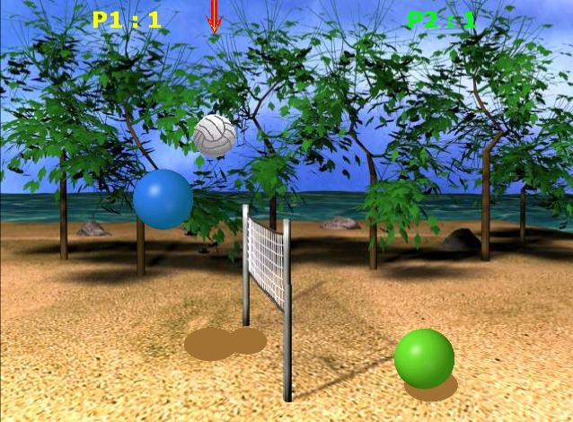



## Volley Spheres \- a complete DirectX game

### Description

Volley Spheres is a simple yet amazing game. It can be played by 1 person ( AI opponent ) or 2. Using DirectPlay gives you the ability to play the multiplayer game with a buddy from the internet, or in your LAN. The game was not supposed to be published nor here neither at www.spider-bit.com so it is not very commented ( the purpose of the game is not to teach who to create that big games ). It has Excellent sound effects and graphics made using Paintshop and 3D Studio max. Have Fun :) PLEASE VOTE AND VISIT WWW.SPIDER-BIT.COM
 
### More Info
 

             |
---                |---
**Submitted On**   |2004-12-30 13:33:40
**By**             |[George Papadopoulos  \- VirusFree](https://github.com/Planet-Source-Code/PSCIndex/blob/master/ByAuthor/george-papadopoulos-virusfree.md)
**Level**          |Advanced
**User Rating**    |4.8 (24 globes from 5 users)
**Compatibility**  |VB 5\.0, VB 6\.0
**Category**       |[Games](https://github.com/Planet-Source-Code/PSCIndex/blob/master/ByCategory/games__1-38.md)
**World**          |[Visual Basic](https://github.com/Planet-Source-Code/PSCIndex/blob/master/ByWorld/visual-basic.md)
**Archive File**   |[AMAZING\_Di1840381162005\.zip](https://github.com/Planet-Source-Code/george-papadopoulos-virusfree-volley-spheres-a-complete-directx-game__1-58309/archive/master.zip)

